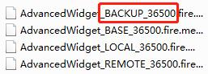

# Creator Smart-Merge Tool

### 为什么设计这个工具?

这个工具提供给广大 Cocos Creator 开发者用于合并不同版本或相同版本下的场景内容修改分歧。对于开发者来说，希望将不同修改的场景数据融合是十分困难的一件事情，因为目前 Cocos Creator 场景文件的数据存储结构对于融合这一概念并不友好（想必很多用户已经体验过了）。为解决这一难题，从而制作了这个简陋的小工具。
工具本身内容不多，如果有任何问题，建议有想法的你在文中的 git 仓库链接中提交你的想法。<br>
https://github.com/cocos-creator/smart-merge-tool/issues

### 针对人群：

当前这个工具仍然处于非常初级的阶段，对于非程序员而言，调试配置过程可能相对困难，因此建议是有一定工具使用经验的 __程序员__ 来操作这个工具。

### 包含的功能：

- 合并 .fire 后缀的场景文件。
- 合并 .prefab 为后缀的预制体文件。

### 合并原理：

这个工具并不是独立存在的集成工具，而是需要依赖于项目管理工具（例如：SourceTree） 以及合并冲突解决工具（例如：KDiff3）这两类工具存在的。
这里重点强调一下合并冲突解决工具，这一类工具属于半自动化工具，可以自动识别你当前文件的冲突内容并且自动的解决这部分简单的冲突，但是有部分的冲突超出了它的能力范围，你需要 __手动__ 的对这些冲突进行选择并且合并。<br>
Creator Smart-Merge(以下简称 __CSM__)工具首先通过识别你当前使用的合并工具，在解决冲突时产生的 BASE, LOCAL, REMOTE 三个文件（如下图），然后将三个文件相关内容数据进行重新排序。
 

以上操作，CSM 会调用用户在工程下创建的 mergeConfig.json 文件，通过识别用户配置数据，调用用户习惯使用的第三方冲突解决工具。在用户手动的解决所有期望的调整之后，工具会自动的生成一个新的文件覆盖你当前的冲突场景文件。<br>
在合并过程中会有一个 MergeCache 文件夹和一个 merge.json 文件生成，MergeCache 文件夹下是三个经过数据处理对应场景文件的 json 文件。 merge.json 文件是通过第三方冲突解决工具保存生成的合并文件。

### 合并冲突解决工具配置流程：

1. 安装合并工具到全局设置。
   ```
   npm install -g creator-smart-merge
   ``` 
2. 配置你的版本管理工具(目前只支持 SourceTree)，点击 Tools -> Options -> Diff 设置 MergeTool 为 Custom, 并配置 Diff Command 为 merge 指令,传入参数设置为:
    ```
    start $BASE $LOCAL $REMOTE
    ```
3. 在当前的工程文件中新建一个 mergeConfig.json 文件，内容配置为：
    ```
    {
        // 冲突解决工具
        "smartMerge": {
            "dependMergeTool": "D:/KDiff3/KDiff3.exe"
        },
        // 过滤可自动处理的选项
        "replaceData": {
            "dataType": [],
            "dataName": [],
            "branch": [],
            "isReplace": false
        }
    }       
    ```
    - smartMerge.dependMergeTool: 工具为你当前电脑上常用冲突解决工具，目前因为工具较为简陋，支持最好的是 KDiff3 工具，建议使用，当然如果你对工具的使用较为了解，也可以自行针对 CSM 的代码进行简单的调整用于适应你的工具。
    - replaceData: 是额外的辅助功能部分，仅针对场景或者预制体（prefab）__节点__ 相同但是数据不同的合并冲突有效，因为无法做到对不同节点数量的数据排序以及合并内容的完全一一对应，所以这个功能仅仅是帮助你减少一部分的工作量。
        - dataType：数据类型可选类型为： "Node", "Component", "PrefabInfos", "ClickEvent"。
        - dataName：数据名称，例如："_name", "_children"... 选取为当前数据类型下content 结构中含有的数据成分。
        - branch: 替换数据的分支，三个选择："Base", "Local", "Remote"。
        - isReplace：是否进行替换，false 时将直接将排序后的文件返回给你。

### 操作流程：

#### 场景合并：

##### 同版本合并：

同一版本的合并较为简单，当冲突产生时，只要按照上方 “合并冲突解决工具配置流程” 的方案设置好内容之后在 SourceTree 下右键点击冲突文件内容 Resolve Conflicts -> Execute External Merge Tool，就可以直接运行当前设置的工具了。

##### 跨版本合并：

随着 Cocos Creator 的不断发展，2.0 版本的编辑器以及引擎已经推出，这个新版本针对文件结构进行了大量的修改，因此在合并场景过程中，我并 __不建议__ 您去合并不同版本的场景，那样会带来大量不可预计的错误，同时合并的难度比起相同版本下场景合并也会加大。
但是如果你有刚需，那么这里也提供以下这种合并的方案。 __强烈建议合并场景前请一定要保存好备份__

Creator 针对 1.0 到 2.0 分别采用的不同的数据模式，2.0 的数据更加的丰富与完善，因此 1.0 版本场景在合并到 2.0 版本过程中会有更多的问题，在此仅提供一个项目开发过程中实现的办法。
首先你需要将 SourceTree 上文中提到的 diff tool 设置成为你当前常用的冲突解决工具（如：KDiff3）这个时候当你开始合并时，SourceTree 会主动调用那个工具，并且生成三个冲突文件，你的任务就是配置好 testHelper.js （这里下文会有介绍）的调用方法之后，先通过 __2.0 版本__ 的编辑器，依次打开三个场景文件并保存，将三个冲突的场景文件数据都升级到 2.0 版，在这个基础上通过调用 testHelper.js 直接开始合并你的场景。
合并完成之后如上文所说合并完成的场景文件会覆盖原场景文件，这个时候场景文件可以在编辑器内打开了。你要通过复制的方式将文件 copy 一份在本地，之后点击 SourceTree 的 Abort 放弃本次冲突解决，因为你没有使用正常流程解决冲突，SourceTree 会帮你把场景文件恢复成冲突状态，这个时候你将 copy 的完成式文件覆盖这个冲突场景文件，然后直接保存到提交中就 ok 了。<br>
跨版本冲突解决比较麻烦，如果觉得文档有什么不清楚的地方可以到文中链接地址处提交 issue 进行交流。

#### 合并完成时：

建议合并完成之后进入对应版本编辑器查看场景是否可以打开，因为冲突场景在编辑器内是无法开启的。确认无误之后进行 Commit 提交。

#### 因为意外中止了合并：

SourceTree 这一类的版本管理工具不同于命令行会显示详细的报错信息，因此您可能在合并过程以及结束时遇到一些问题，以下假设几个情景可能会帮助你解决遇到的问题。

##### 情景一：

成功的合并了三个文件生成了 merge.json 文件但是却没有覆盖冲突场景。
这很有可能是 merge.json 文件出了问题，因为 json 文件对格式要求比较高，在大型多节点场景中难免会有格式或者数据错误，这时候文本无法正确识别 json 文件内容，就会产生中断报错。<br>
解决方案：
1. 重新合并一次。
2. 如格式问题比较简单，并且确认其他数据正常的情况下，建议手动修改 json 文件，再调用额外工具中 singleCoverPart.js 文件，直接进行场景文件转换。

##### 情景二：

成功生成并覆盖了原有场景，但是编辑器无法打开场景或者场景内节点丢失，组件丢失。
这属于合并场景中常见的问题，因为新的场景文件是根据 \_\_id\_\_ 索引 寻找对应数据信息的，如果合并中没有选取同分支数据对象，在 json 转换 fire 文件过程中就无法正确的获得数据信息。
解决方案：
1. 检查相关节点引用 id 重新进行合并。因为丢失的节点是不会录入新的场景文件中的。

### 额外的脚本工具：

首先从以下网址中将工具内所有的脚本下载下来（这其实就是这个工具的工作原理）：https://github.com/cocos-creator/smart-merge-tool <br>
顺便建议采用 vsc 进行工具调试。 这里有两个特殊调试文件可以供你来使用 testHelper.js 和 singleCoverPart.js 当然这两个脚本因为是我个人调试用的，所以配置起来可能会有点麻烦。
那么来介绍一下这两个脚本吧， singleCoverPart.js 是当你合并场景失败了但是已经产生了 merge.json 文件时，merge.json 文件内容中有部分错误，但是错误仍然在可手动处理范围内（这个是否可处理，就是看你个人的理解能力了）你可以手动的处理这些低级的错误之后配置 launch.json 文件或者直接使用命令行调用命令（我个人更建议配置 launch.json）:
```
node singleCoverPart.js /you/program/dir/ fileName
```

传入两个参数，你工程的绝对路径以及需要替换的场景名称。
这样可以直接调用 coverMerge.js 脚本合并部分的功能，使你不必重新合并大量的数据。
testHelper.js 脚本用于调用 bin 目录下的 index.js 文件，一样需要你配置一下 vsc 的 launch.json 或者使用 cmd 直接调用。调用命令为：
```
node testHelper.js start path fileName.fire/.prefab
```

path 参数为项目当前冲突文件所在位置的绝对路径，
fileName 传入不是当前文件名称。而是 SourceTree 合并工具生成的 BASE 分支文件，文件名称举例为： SceneName_BASE_123456.fire 这种类型。(至于为什么是这种文件名称和上方的解决冲突方案相关。)<br>

### 生成的 json 文件数据结构分析：

```
 {
     // 当前生成 json 文件的对比格式。
    "__id__": "cc.Node: Background, id: 0a930RkW5pOkKgXYzQG0cOj",
    "content": {...},    
	"_components": [],
	"_prefabInfos": [],
	"_clickEvent": []
 }
``` 
- \_\_id\_\_：是一个由代码生成的数据唯一标识。合并工具会根据这个唯一标识对数据内容的索引进行位置确认。生成标识的结构针对不同的数据类型会有细微的变化。<br>
- content：为 fire 文件内的原数据内容，但是为了更好的合并 cc.Node 类型去除了 components, prefab 两个数据的索引信息。 <br>
- _prefabInfos：当前节点的 prefab 信息。<br>
- _components：是当前节点的绑定组件内容。<br>
- _clickEvent: 当前点击事件的绑定对象数据。

#### \_\_id\_\_ 标识

```
${_type: String}: ${name: String}, id: ${_id: String}, [index: Number]
```

以上为标识识别格式。 SceneAsset、Scene、Node、PrivateNode、Component、CustomeEvent、ClickEvent 都会生成一个类似标识，用于帮助你在合并排查时确认是否是同一对象。


### 存在无法解决的问题：

- 比较特殊的冲突问题是针对 _id 数据的比较，目前没有特别好的办法调整。<br>
举例而言，当一个版本场景下增添了一个节点数据，在另一个版本下并没有通过合并的方式修改场景，而是通过手动增添一个同样的节点数据在场景中，这会导致相同的节点数据信息但是拥有不同的 _id 数据，因为新生成的节点都会有相应的唯一 _id 生成。最终，不同的 _id 在对比冲突的过程中会干扰排序，比较，融合等一系列操作。<br>
- 冲突对比过程中，以上结构尽量减少了 \_\_id\_\_ 的存在，想要通过索引信息查找需求对应的数据会比较困难。